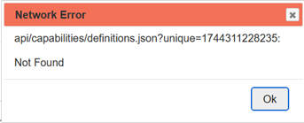
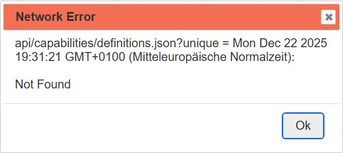
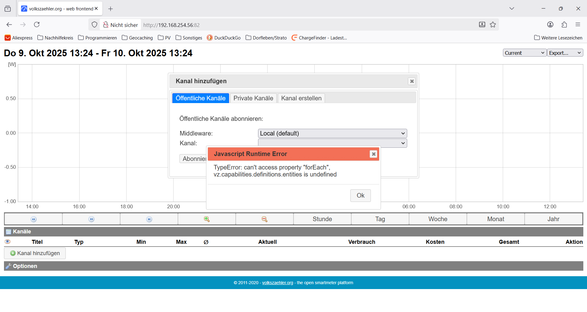

[![CC BY-NC-SA 4.0][cc-by-nc-sa-shield]][cc-by-nc-sa]

This work is licensed under a
[Creative Commons Attribution-NonCommercial-ShareAlike 4.0 International License][cc-by-nc-sa].

[![CC BY-NC-SA 4.0][cc-by-nc-sa-image]][cc-by-nc-sa]

[cc-by-nc-sa]: https://creativecommons.org/licenses/by-nc-sa/4.0/deed.de
[cc-by-nc-sa-image]: https://licensebuttons.net/l/by-nc-sa/4.0/88x31.png
[cc-by-nc-sa-shield]: https://img.shields.io/badge/License-CC%20BY--NC--SA%204.0-lightgrey.svg

---
# Installation Instructions <br>for AhoyDTU on Raspberry-Pi with <br> NGINX-WebServices and the Volkszaehler-Smart-Meter

## Volkszaehler (VZ) Smart Meter configuration instructions
To store and to analyse operational data of the AhoyDTU we'll use a `Volkszaehler` environment.  
This `Volkszaehler` environment need some additional middleware:
* `NGINX` Web-Service (allready installed and configured with AhoyDTU)
* `PHP FastCGI Process Manager` (allready installed and configured with AhoyDTU)
* `PHP Composer` to install additional PHP-libraries
* `MariaDB` database

additional Informations in german language on:  
https://github.com/PaeserBastelstube/AhoyDTU4RPi/wiki/03.-Volkszaehler

## Install PHP Composer
Our `Smart-Meter Volkszaehler` calls some `PHP-scripts` and these PHP-scripts require specific `PHP-libraries`.
In order to use these PHP-libraries, they must be installed using the PHP-package-manager `Composer`.
We first install the PHP-package-manager.
```code
cd /tmp
curl -sS https://getcomposer.org/installer | php
sudo mv composer.phar /usr/local/bin/composer
sudo chmod +x /usr/local/bin/composer
```
* install with composer for https://www.php.net/manual/en/book.shmop.php

## Installation of certain PHP package libraries 
```code
cd /home/volkszaehler/
composer install
# If we get various error messages, so we add some “ignore” parameters and start the installation process again:
composer install --ignore-platform-req=ext-dom --ignore-platform-req=ext-xml --ignore-platform-req=ext-xmlwriter
composer require php-mqtt/client --ignore-platform-req=ext-dom --ignore-platform-req=ext-xml --ignore-platform-req=ext-xmlwriter
```
## Additional Channel Type "power meter"
Our VZ environment requires the additional channel type "power meter" to manage the "electrical energy" from an electricity meter.  
The VZ configuration file `EntityDefinition.json` is already predefined in our AhoyDTU file archive.
To activate this configuration, please take the following steps:
```code
cd /home/volkszaehler/lib/Definition
mv EntityDefinition.json EntityDefinition.json.org
ln -fs /home/AhoyDTU/etc/vz/EntityDefinition.json EntityDefinition.json
```

---
# "MariaDB" - Configure and start the database 
The middleware database "MariaDB" was already installed in a previous step.

## Securing the database
The installation is complete at this point, however, the database still needs to be additionally secured.  
Access to the database is not yet password-protected, test users and test databases are still installed and must be deleted.
These steps will now be performed.
```code
sudo mysql_secure_installation
```
The setup will be answered with the following values:
|##| Question                             | Answer   | Comment
|--|--------------------------------------|----------| -------- |
|1:|Enter current password for root       | ENTER    | Press Enter to confirm; we will not enter anything.|
|2:|Set root password	                    | Y        | und dann ein Passwort für den Benutzer root vergeben|
|3:|Switch to unix_socket authentication  |	Y	       | |
|4:|Change the root password? [Y/n]       | N        | |
|5:|Remove anonymous users                | Y        | We don't want such users.|
|6:|Disallow root login remotly           | Y        | Only the root user is allowed to log in locally|
|7:|Remove test database and access to it | Y        | We don't need a test database.|
|8:|Reload privilege tables now           | Y        | these need to be reloaded|

## Start database “MariaDB”
The following commands are used to start the database and check status:
```code
sudo systemctl start mariadb
sudo systemctl status mariadb
```
Next, list and check important files and variables:
```code
my_print_defaults --mysqld
```
## “MariaDB” first connection Test
For the first connection test, call the command: 
`sudo mysql -uroot -praspberry`
and quit the command with `exit;`

```code
Welcome to the MariaDB monitor.  Commands end with ; or \g.
Your MariaDB connection id is 41
Server version: 10.11.3-MariaDB-1+rpi1 Raspbian 12

Copyright (c) 2000, 2018, Oracle, MariaDB Corporation Ab and others.

Type 'help;' or '\h' for help. Type '\c' to clear the current input statement.

MariaDB [(none)]> exit;
Bye
```
---

# Volkszaehler - Troubleshooting and special configuration
To Troubleshoot some Error Messages, we have to correct some VZ-scripts and configurations.  

## First error message
Start VZ in your prefered browser:
```code
http://localhost/htdocs
```
After accessing `Volkszaehler` we receive the following error message:  


To resolve this error message, several steps are required. First, let's look at the error message itself.  
The long number represents a "timestamp," unfortunately not the date and time in a readable format.  
To print this timestamp in a human readable format, the file `/home/volkszaehler/htdocs/js/functions.js`  
must be modified, starting at line 128:  

old:
```code
128     if (args.method === undefined || args.method == 'GET') {
129         args.url += '?unique = ' + Date.now();
130     }
```
new:
```code
128     if (args.method === undefined || args.method == 'GET') {
129         timeNow = new Date();
130         args.url += '?unique = ' + timeNow;
131     }
```

## second error message
After restart Volkszaehler in your prefered browser, we receive the next error message:  


This error message indicates a wrong URL configuration in `htdocs/js/options.js`  
Please edit this file in line 42:
```code
old:		url: 'api'
new:		url: 'middleware.php'
```

## next error message
After restart Volkszaehler in a browser we receive the next error message:  


This error message indicates a missing database connection.  
Now, we need to adjust the Volkszaehler configuration accordingly.
```code
cd /home/volkszaehler/etc/
cp config.dist.yaml config.yaml
vi config.yaml
```
In `config.yaml`, you find the passwords for USER and ADMIN.

Now, we have to configure this `passwords` in database configuration:
```code
sudo mysql -uroot -praspberry
CREATE DATABASE volkszaehler;  # Anlegen der Datenbank
GRANT ALL ON volkszaehler.* to 'vz_admin'@'localhost' IDENTIFIED BY 'admin_demo' WITH GRANT OPTION;
CREATE USER 'vz'@'localhost' IDENTIFIED BY 'demo';
GRANT USAGE ON volkszaehler.* TO 'vz'@'localhost';
GRANT SELECT, UPDATE, INSERT ON volkszaehler.* TO 'vz'@'localhost';
exit;
```
